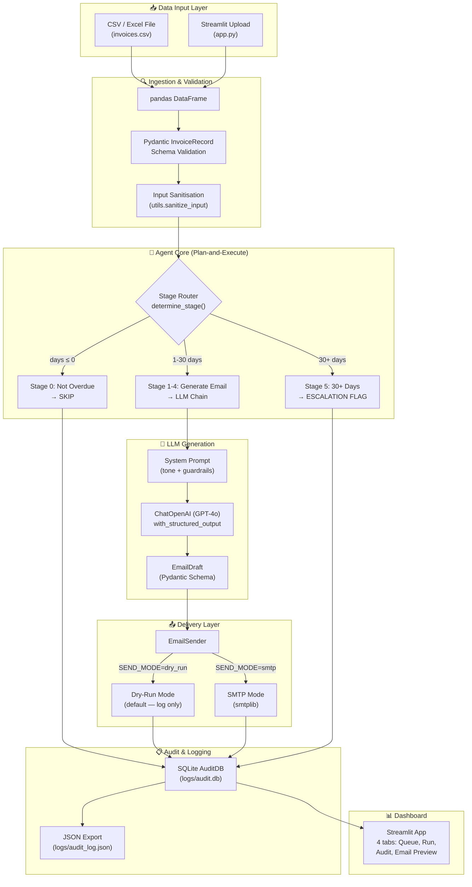

# Architecture Documentation

## Agent Architecture Diagram

## Component Responsibilities

| Component | File | Responsibility |
|-----------|------|---------------|
| **Schema** | `src/schema.py` | Pydantic models for `InvoiceRecord` and `EmailDraft` |
| **Agent** | `src/agent.py` | Stage determination + LLM email generation |
| **Utils** | `src/utils.py` | Input sanitisation, PII masking, formatters |
| **Database** | `src/database.py` | SQLite audit trail CRUD |
| **Email Sender** | `src/email_sender.py` | SMTP/dry-run email delivery |
| **Main** | `src/main.py` | CLI pipeline orchestrator |
| **Scheduler** | `src/scheduler.py` | APScheduler cron integration |
| **Dashboard** | `app.py` | Streamlit UI |

## Design Philosophy

**Plan-and-Execute over ReAct**: The email generation workflow is deterministic and linear. Using a ReAct agent loop would introduce unnecessary hallucination risk for client-facing communications. Instead, we use a static plan-and-execute pattern where the stage router deterministically selects the action, and the LLM is only called for the creative task of drafting the email within strict guardrails.